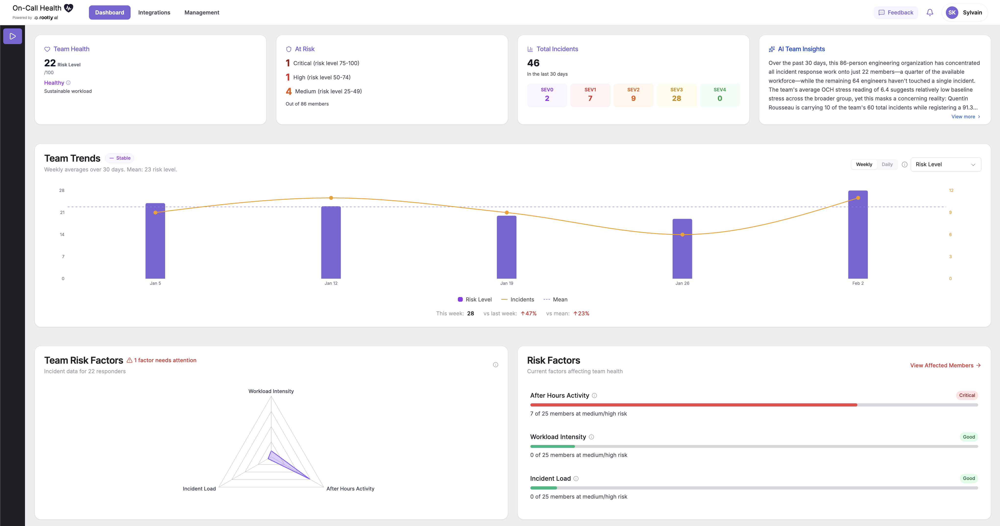

# On-call Health


Catch exhaustion before it burns out your incident responders.

On-Call Health integrates with Rootly, PagerDuty, GitHub, Slack, Linear, and Jira to collect objective and self-reported data to identify signs of overload among on-call engineers. Free and open-source.

Get started at [www.oncallhealth.ai](https://www.oncallhealth.ai/) or [self-host it.](#Installation)



##  Methodology

On-call Health measures overwork risk in professional settings. On-call Health isn't a medical or diagnostic tool; it is designed to help identify patterns and trends that may suggest overwork.

The tool is centered around 2 main metrics:
* **On-Call Health (OCH) Score** — A composite score derived from all collected signals, reflecting an individual's incident response workload.

* **Score Trend** — How the OCH score evolves over time relative to each responder's own baseline.

The OCH score measures workload, not well-being directly. People respond differently to incidents, after-hours work, and pressure; some thrive under high-severity incidents, while others don't. The score trend captures whether someone's workload is shifting from *their* normal, regardless of where that normal sits.

##  Data Collection

* **Incident Response:** Volume, severity, time-to-acknowledge, time-to-resolve, after-hours pages, consecutive on-call days (PagerDuty, Rootly)

* **Work Patterns:** After-hours and weekend activity, commit/message timing distribution, on-call shift frequency (Rootly, PagerDuty, GitHub, Slack)

* **Workload:** Active issues assigned, PR volume and size, commit frequency, code review participation (Jira, Linear, GitHub)

* **Self-Reported Wellbeing**: Feeling and workload scores, stress factors, personal circumstances (Slack surveys)

## Integrations ⚒️
* [Rootly](https://rootly.com/): For incident management and on-call data
* [PagerDuty](https://www.pagerduty.com/): For incident management and on-call data
* [GitHub](https://github.com/): For commit activity
* [Slack](http://slack.com/): For communication patterns and collecting self-reported data
* [Linear](https://linear.app/): For workload tracking
* [Jira](https://www.atlassian.com/software/jira): For workload tracking

If you are interested in integrating with On-call Health, [get in touch](mailto:sylvain@rootly.com)!

## Installation

### 1) Environment Variables
⚠️ For login purposes, you **must** configure OAuth tokens for Google OR GitHub OAuth:
```
# Create a copy of the .env file
cp backend/.env.example backend/.env
```

<details>
<summary><b> Google Auth - Token Setup Instructions</b></summary>

1. **Enable [Google People API](https://console.cloud.google.com/marketplace/product/google/people.googleapis.com)**
2. **Get your tokens**
	* Create a [new project](https://console.cloud.google.com/projectcreate)
	* In the **Overview** tab, click on **Get started** button and fill out info
	* Go to the **Clients** tab and click on **+ Create client** button
	* Set **Application type** to **Web application**
	* Set **Authorized redirect URIs** to `http://localhost:8000/auth/google/callback`
	* Keep the pop-up that contains your **Client ID** and **Client secret** open
3. **Fill out the variable `GOOGLE_CLIENT_ID` and `GOOGLE_CLIENT_SECRET` in your `backend/.env` file**
4. **Restart backend `docker compose restart backend`**
</details>

<details>
<summary><b> GitHub Auth - Token Setup Instructions</b></summary>

1. **Visit [https://github.com/settings/developers](https://github.com/settings/developers)**
	*  Click **OAuth Apps** → **New OAuth App**
	* **Application name**: On-Call Health
	- **Homepage URL**: http://localhost:3000
	- **Authorization callback URL**: http://localhost:8000/auth/github/callback
2. **Create the app:**
	* Click **Register application**
	* You'll see your **Client ID**
	* Click **Generate a new client secret** to get your **Client Secret**
3. **Add to `backend/.env:`**
4. **Restart backend:**
</details>

### 2) Docker Setup
Use our Docker Compose file.
```
# Clone the repo
git clone https://github.com/Rootly-AI-Labs/on-call-health
cd on-call-health

# Launch with Docker Compose
docker compose up -d
```

### Manual setup
<details><summary>You can also set it up manually, but this method isn't actively supported.</summary>

### Prerequisites
- Python 3.11+
- Node.js 18+ (for frontend)
- Rootly or PagerDuty API token

### Backend Setup
```bash
cd backend
python -m venv venv
source venv/bin/activate  # or `venv\Scripts\activate` on Windows
pip install -r requirements.txt

# Copy and configure environment
cp .env.example .env
# Edit .env with your configuration

# Run the server
python -m app.main
```

The API will be available at `http://localhost:8000`

### Frontend Setup
```bash
cd frontend
npm install
npm run dev
```

The frontend will be available at `http://localhost:3000`
</details>

## API

On-call Health also offers [an API](https://api.oncallhealth.ai/docs) and [MCP server](https://github.com/Rootly-AI-Labs/On-Call-Health/tree/main/packages/oncallhealth-mcp) that can expose its findings. <br>
[](https://god.gw.postman.com/run-collection/45004446-1074ba3c-44fe-40e3-a932-af7c071b96eb?action=collection%2Ffork&source=rip_markdown&collection-url=entityId%3D45004446-1074ba3c-44fe-40e3-a932-af7c071b96eb%26entityType%3Dcollection%26workspaceId%3D4bec6e3c-50a0-4746-85f1-00a703c32f24)

## 🔗 About the Rootly AI Labs
On-call Health is built with ❤️ by the [Rootly AI Labs](https://rootly.com/ai-labs) for engineering teams everywhere. The Rootly AI Labs is a fellow-led community designed to redefine reliability engineering. We develop innovative prototypes, create open-source tools, and produce research that's shared to advance operational excellence standards. We want to thank Anthropic, Google Cloud, and Google DeepMind for their support.

This project is licensed under the Apache License 2.0.
